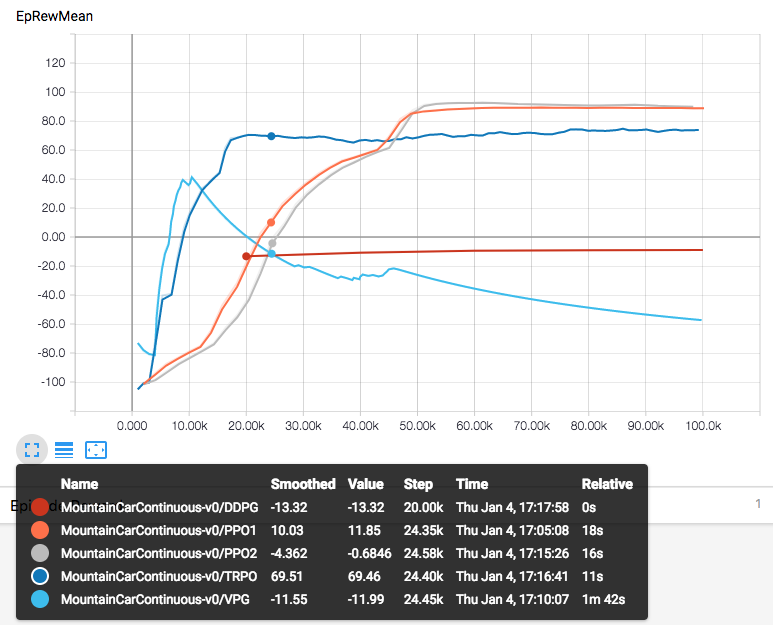
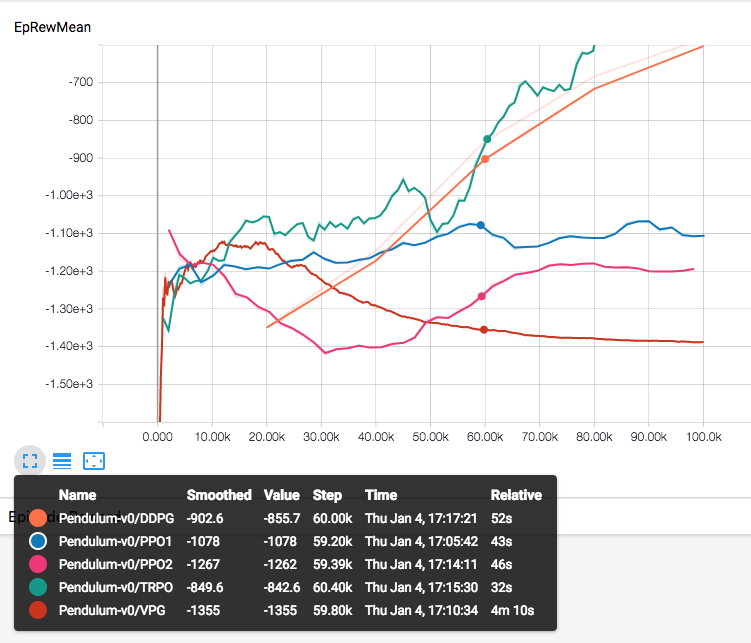

# Reviewing Vanilla Policy Gradient (VPG)

In the previous tutorial we could observe that VPG was somehow not doing good and whatever it learned
was lost after a few timesteps. This was observed in both `MountainCarContinuous-v0` and `Pendulum-v0`:




The purpose of this tutorial is to inspect why this is happening and how VPG can be improved.

One of the possible reasons behind this might be the fact that the Neural Network used to represent both
the actor (policy estimator) and the critic (value estimator) are just linear classifiers:

```python
class PolicyEstimator():
...
        with tf.variable_scope(scope):
            self.state = tf.placeholder(tf.float32, [400], "state")
            self.target = tf.placeholder(dtype=tf.float32, name="target")

            # This is just linear classifier
            self.mu = tf.contrib.layers.fully_connected(
                inputs=tf.expand_dims(self.state, 0),
                num_outputs=1,
                activation_fn=None,
                weights_initializer=tf.zeros_initializer)
            self.mu = tf.squeeze(self.mu)

            self.sigma = tf.contrib.layers.fully_connected(
                inputs=tf.expand_dims(self.state, 0),
                num_outputs=1,
                activation_fn=None,
                weights_initializer=tf.zeros_initializer)
...

```

```python

class ValueEstimator():
...
        with tf.variable_scope(scope):
            self.state = tf.placeholder(tf.float32, [400], "state")
            self.target = tf.placeholder(dtype=tf.float32, name="target")

            # This is just linear classifier
            self.output_layer = tf.contrib.layers.fully_connected(
                inputs=tf.expand_dims(self.state, 0),
                num_outputs=1,
                activation_fn=None,
                weights_initializer=tf.zeros_initializer)
...
```

whereas other policy gradient techniques are using the following setups:
- PPO1:
  - `num_hid_layers`: 2 (number of hidden layers)
  - `hid_size`: 64 (neurons per hidden layer)
  - `activation`: `tf.nn.tanh`
- PPO2:
  - `num_hid_layers`: 2
  - `hid_size`: 64
  - `activation`: `tf.tanh`
- TRPO:
  - `num_hid_layers`: 2
  - `hid_size`: 32
  - `activation`: `tf.nn.tanh`
- DDPG (both actor and critic):
  - `num_hid_layers`: 2
  - `hid_size`: 64
  - `activation`: `tf.nn.relu`

Clearly, there seems to be room for improvement here. Let's try redefining VPG using
`num_hid_layers`: 2 and `hid_size`: 64 with `activation`: `tf.nn.tanh`.

```python
...
# Define mu as a 2-hidden layer NN
h1_mu = tf.contrib.layers.fully_connected(
    inputs=tf.expand_dims(self.state, 0),
    num_outputs=64,
    activation_fn=tf.nn.tanh,
    weights_initializer=tf.zeros_initializer)

h2_mu = tf.contrib.layers.fully_connected(
    inputs=h1_mu,
    num_outputs=64,
    activation_fn=tf.nn.tanh,
    weights_initializer=tf.zeros_initializer)

self.mu = tf.contrib.layers.fully_connected(
    inputs=h2_mu,
    num_outputs=1,
    activation_fn=None,
    weights_initializer=tf.zeros_initializer)
...
```

for both `mu` (mean) and `sigma`(stdev) in the policy estimator as well as in the value estimator we obtain the following results:

Didn't help at all. It seems the implementation itself is wrong:
- https://github.com/dennybritz/reinforcement-learning/issues/110
- https://github.com/dennybritz/reinforcement-learning/issues/64
